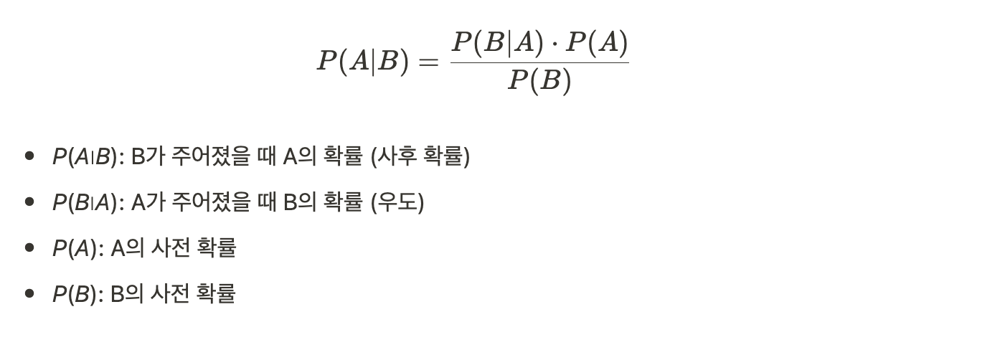
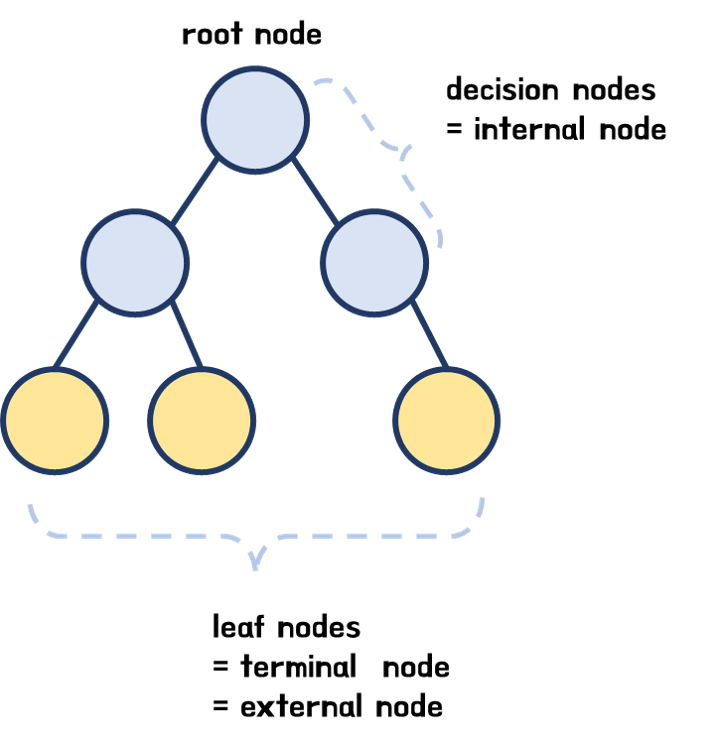

# Week3 : 지도학습
#### 용어 정리
* 종속변수와 독립변수 : 종속변수가 독립변수에 의해 영향을 받음
  * 종속변수 : 결과물 또는 효과
  * 독립변수 : 입력값이나 원인
* 과적합 (overfitting)
  * 모델이 학습데이터에 지나치게 학습 -> 일반화 불가
  
## 회귀모델

### 선형회귀 (Linear Regression)
: 종속변수와 독립변수가 선형. 즉, 간단한 덧셈과 곱셈으로 이뤄진 관계일 때 사용하는 모델
* 종류
  * 단순 선형 회귀 : 1개의 독립변수. 1개의 종속변수
  * 다중 선형 회귀 : 여러 개의 독립변수. 1개의 종속변수
* 목적함수 (Loss Function) : 예측키와 정답키 간의 오차 정도를 나타내는 함수
* -> 학습을 통해 이 오차를 최소화 시키는 것이 목표!
```py
import numpy as np    # 연산
import pandas as pd   # 데이터 처리
from sklearn.model_selection import train_test_split    # (model_selection)데이터 분할 기능
from sklearn.linear_model import LinearRegression       # (linear_model)선형모델 - (LinearRegression)선형 회귀
from sklearn.metrics import mean_squared_error, r2_score # (metrics) 모델 성능 평가 지표

# 데이터 생성
# (X)독립 변수 , (Y)종속 변수
X = np.array([[1, 1], [2, 2], [3, 3], [4, 4], [5, 5],[6,6]])
y = np.array([1, 2, 3, 4, 5, 6])

# 데이터 분할 
# train_test_split(독립변수,종속변수,테스트 비율,데이터셋 랜덤 분할 값)
X_train, X_test, y_train, y_test = train_test_split(X, y, test_size=0.2, random_state=42

# 선형 회귀 모델 생성 및 학습
model = LinearRegression()
# fit(테스트데이터,테스트정답) : 학습 진행
model.fit(X_train, y_train)

# 예측
# predict(테스트 위한 독립변수) 
# 정답을 넣으면 안 됨
y_pred = model.predict(X_test)

# 모델 평가
mse = mean_squared_error(y_test, y_pred)
r2 = r2_score(y_test, y_pred)
print(f'Mean Squared Error: {mse}')    # mse 값이 0 에 가까운 값이 나올수록 예측 성능 좋다는 뜻
print(f'R^2 Score: {r2}')    # r2 값이 1에 가까운 값이 나올수록 예측 성능이 좋다는 뜻

```
* 예측 결과

### 다항회귀 (Polynomial Regression)
: 종속변수와 독립변수 간의 비선형관계를 모델링
-> 선형회귀보다 추론력이 높음
* 다항회귀의 차수(Degree) 
  * 차수가 높을수록 모델이 복잡해짐 -> 과적합 발생 우려
* 과적합 (overfitting)
  * 모델이 학습데이터에 지나치게 학습 -> 일반화 불가

## 분류모델
### 로지스틱 회귀
: 종속변수가 이진형일 때 사용되는 통계 기법
* 선형회귀와 달리 결과값이 0과 1사이 위치하도록 시크모이드 함수(Sigmoid Function) 사용
* 비용함수 
  * 모델의 예측 확률과 실제 레이블 사이의 차이를 측정
    * 확률이 1에 가까움->예측 good
    * 확률이 0에 가까움->예측 bad

### SVM(Support Vector Machine)
: 분류와 회귀분석에 사용되는 강력한 지도학습 모델
* 데이터 분류를 위해 결정 경계(결정초평면,typerplane)를 찾아 분류
* 초평면은 두 클래스 사이의 최대 마진( 두 클래스간 가장 가까운 데이터 포인트 사이 거리 ) 을 보장하는 방식으로 선택

### KNN(K-Nearest Neighbors)
: 분류와 회귀분석에 사용된느 비모수적 방법
* 비모수적방법(통계용어)
  * 관측값이 어느 특정 확률분포를 따른다고 전제 할 수 없거나 모집단에 대한 아무런 정보가 없는 경우 실시하는 검정 방법
* 데이터를 펼쳐 놓아서 학습함
* 새 데이터가 들어오면, 특성을 보고 가장 가까운 K개의 이웃과 비교하여 분류

### 나이브베이즈(Naive Bayes)
* 베이즈 정리
  
* Naive : 각 특징(Feature)이 독립적 
* 모델이 단순. 효율적 -> 텍스트 분류 문제에 사용
* 종류
  * 가우시안 : 특징들이 연속적. 정규분포를 따른다고 가정
  * 베르누이 : 특징들이 이진수로 표현되는 경우
  * 멀티노미얼 : 특징들이 다항분포를 따르는 경우
### 의사결정 나무 (Decision Tree)
: 데이터의 특징을 기준으로 의사결정 규칙을 만들고 이를 바탕으로 데이터를 분류. 회귀
* 트리 구조
  * 노드 : 하나의 특징에 대한 테스트
    * 루트노드 : 트리의 최상위 노드. 전체 데이터셋 나타냄
    * 리프노드 : 트리의 끝 노드. 클래스 레이블을 나타냄
  * 가지

* 분할기준
  * 정보이득 : 엔트로피(Entropy)값으로 데이터를 나누는 기준
  * 엔트로피 : 불확실성을 나타냄. 낮을수록 좋음
