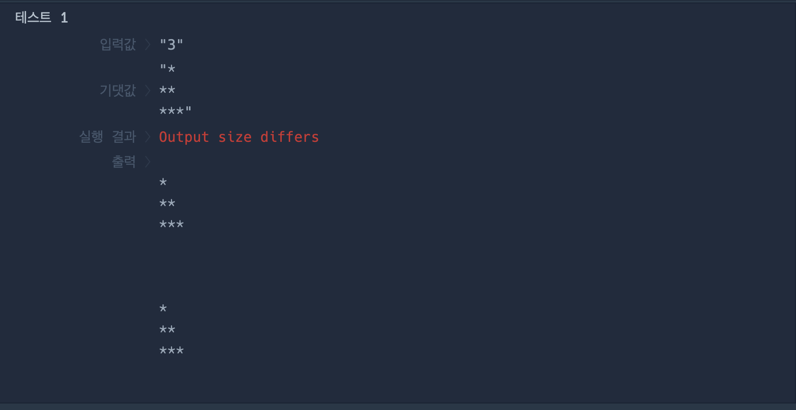
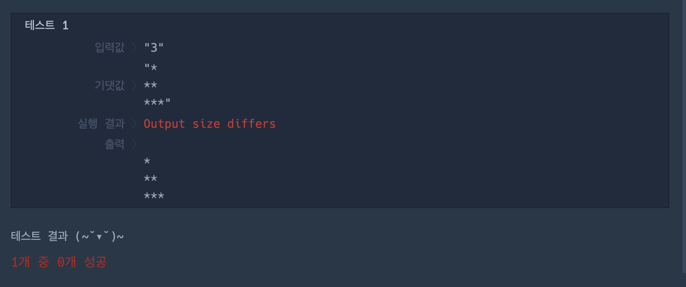
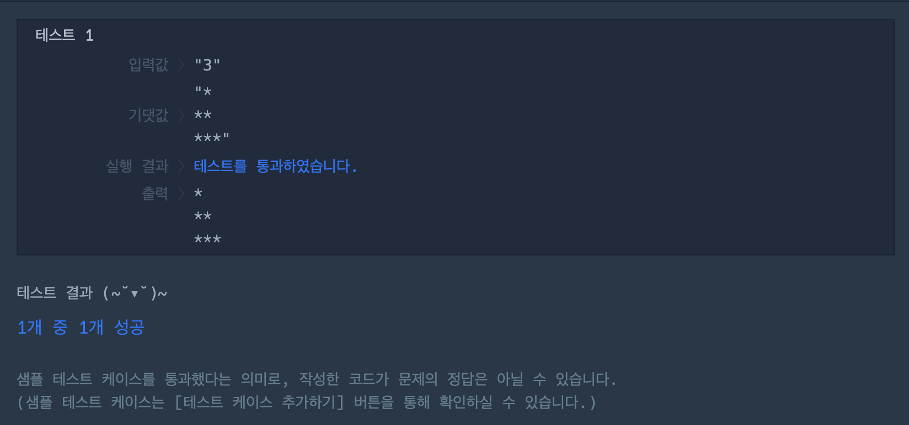

# 내일배움캠프 14일차 TIL
## 파이썬 코드카타 DAY 6
1. 문자열 뒤집기
    * DAY 5 배열 뒤집기 문제를 풀면서 알게 되었던 **슬라이싱**이 **문자열**에도 통할까 싶어 일단 해보았는데 **성공**했다.
    ```py
    def solution(my_string):
        return my_string[::-1]  # 슬라이싱을 사용해 문자열 역순 출력
    ```
2. 직각삼각형 출력하기
   ```py
   # 첫 번째 시도
    n=int(input())
    for i in range(n+1):
        for j in range(n+1):
            print("*"*j)
        print("\n")
    ``` 
    
    * 문제점
      * for 중첩 반복문으로 직각삼각형이 여러 개 출력됨
      * print 문이 끝나고 자동적으로 줄 바꿈이 되나봄
    ```py
    # 두 번째 시도 : 자동 줄바꿈이 되므로 중첩 반복문 없앰
    n=int(input())
    for j in range(n+1):
        print("*"*j)
    ```
    
    * 문제점
      * 출력에서 제일 처음 줄에 빈칸이 출력
      * 두 번째 줄부터 직각 삼각형 출력
    ```py
    # 세 번째 시도 : 시작을 1로 지정해 줌으로써 첫 줄부터 출력하도록 함
    n=int(input())
    for j in range(1,n+1):
        print("*"*j)
    # 성공
    ```
    
3. 짝수 홀수 개수
   ```py
   # 나의 코드
   def solution(num_list):
    even=0
    odd=0
    for i in num_list:
        if i%2==0:
            even+=1
        else:
            odd+=1
    return [even,odd]
   ```

   ```py
   # 참고 할 만한 풀이
   def solution(num_list):
    answer = [0,0]
    for n in num_list:
        answer[n%2]+=1
    return answer
   ```
4. 문자 반복 출력하기
    ```py
    # 나의 코드
    def solution(my_string, n):
    answer=''
    for i in my_string: # i 가 my_string의 값을 하나씩 빼오면
        answer+=i*n # 입력한 수 n 만큼 문자 반복
    return answer 

    # 참고 하기 좋은 코드
    def solution(my_string, n):
    return ''.join(i * n for i in my_string) 
    """
    join 메소드는 iterable 을 하나의 문자열로 결합함. ('')는 결합 할 때사용할 빈 문자열이라 문자열이 입력되면 바로 붙어 합쳐짐
    """
    ```
---
## 팀 과제를 위한 팀 레포지토리
* 리모트 레포지토리 로컬레포지토리로 불러오기
  * 팀장님이 공유한 레포지토리 주소 복사
  * 터미널에서 레포지토리를 만들 공간으로 이동 `cd 이동할파일명` 
  * `git clone 복사한레포지토리주소` 으로 리모트 레포지토리를 로컬레포지토리에 불러오기
* 브랜치 만들기 : `git branch 브랜치명`
* 내 브랜치에서 작업하기 : `git checkout 브랜치명`
* 이후에 변경사항 있을 시 깃 커밋하면 됨
  * 예시 : 'a.txt' 라는 파일을 만들었을 때
    * `git add .`
    * `git commit -m "add a .txt"`
    * `git push`
* 리모트 레포지토리의 변경사항을 로컬 레포지토리로 불러오기
  * 깃허브에서 해당 팀 레포지토리로 들어 간 후, 상단에 `Pull requests`들어가기
  * `New pull request` 클릭 후 상단에 base : `내브랜치명` <- compare : master 선택
  * 하단에 Create pull request 누르고
  * 하단에 생기는 초록 버튼 다시 누르고
  * VSCode 터미널로 이동 후
  * `git pull` 입력하면 됨
---
## 딥러닝 2주차
### 인공 신경망, ANN
(Artificial Neural Network) : 사람의 신경망 모델링 -> 추론
* 구성요소
  * 입력층 : 다양한 종류의 데이터 처리 (사진, table, 문자열 등)
  * 은닉층 :  (특징, 패턴, 규칙 등을 학습) 연산 수행
  * 출력층 : 다양한 문제 처리
    * 회귀 문제 (Regression)
      - 출력 레이어의 뉴런 수는 예측하려는 연속적인 값의 차원과 동일합니다.
      - 활성화 함수로는 주로 선형 함수(linear function)를 사용합니다.
    * 이진 분류 문제 (Binary Classification)
      - 출력 레이어의 뉴런 수는 1입니다.
      - 활성화 함수로는 시그모이드 함수(Sigmoid Function)를 사용하여 출력 값을 0과 1 사이의 확률로 변환합니다.
    * 다중 클래스 분류 문제 (Multi-Class Classification)
      - 출력 레이어의 뉴런 수는 예측하려는 클래스 수와 동일합니다.
      - 활성화 함수로는 소프트맥스 함수(Softmax Function)를 사용하여 각 클래스에 대한 확률을 출력합니다.
* 동작 방식
  * 순전파 : 입력층->은닉층->출력층
  * 손실함수 : 예측 값과 실제 값의 차이 (오차) 계산
  * 역전파 : 오차를 줄이기 위해 가중치 업데이트 (오차가 발생한 출력층에서부터 입력층으로)
    * 학습에서 hyperparameter 를 사용해 성능 조절 가능 (지역 최적값, 전역최적값)
    * 파라미터 : 업데이트를 하기 위한 가중치
## 합성곱 신경망, CNN
(Convolutional Neural Network) 사람의 시각 정보를 모델링 ->이미지
* 구성 요소
  * 합성곱
    * 합성곱 연산 : 필터와 이미지의 픽셀을 곱해 특징 맵을 생성
    * 필터 : 특징 학습
  * 풀링 : 특징 맵의 크기 줄임
    * Max Pooling : 필터 내 최대값 선택. 중요한 특징 강조, 불필요한 정보 제거
    * Average Pooling : 필터 내 평균값 계산. 특징 맵 크기 줄이면서 정보 손실 최소화
    *  풀링 외의 것
       *  padding : 이미지의 끝에 값을 줌(이미지 크기를 키움). CNN의 레이어가 깊어져도 이미지가 너무 작아지는 상황 방지
       *  stride : 필터 움직이는 정도
  * 완전 연결 : CNN은 이미지 처리에 특화, 출력엔 적합하지 않음->이후에 출력레이어로 ANN 활용
## 순환 신경망, RNN
(Recurrent Neural Network) : 시퀀스 데이터(주가, 문장 등)를 다루는데 최적화
데이터가 순환함
t1시점에서 입력 받은 데이터의 출력을 다음 t2시점의 입력 데이터로 사용
순전파
  입력데이터가 순차적으로 네트워크 통과하여 출력 생성 
  각 시점에서 입력데이터와 이전 숨겨진 상태를 결합하여 새로운 숨겨진 상태를 개선하고 이를 출력을 만드는데 사용
역전파
  출력을 실제 값과 비교 -> 오류를 네트워크를 거슬러 올라가며 가중치 업데이트
  *모든 시점의 가중치가 동시에 업데이트됨!*
* 구조
  * 입력데이터와 이전 시간 단계의 은닉상태(누적)를 입력으로 받아서 현재 시간 단계의 은닉상태 출력
  * 은닉 상태를 시퀀스의 정보를 저장하고 다음 시간 단계로 전달
* 동작 원리
  * 시퀀스의 각 시간 단계에서 동일한 가중치 공유->시퀀스 패턴 학습
* 문제점
  * 오래된 기억들은 소실됨 (오래된 시간순으로)
  * 기울기 소실문제 : 학습이 계속 진행되어 층이 많이 쌓이면서 학습 정보가 점점 희미해짐. 학습이 잘 진행되지 않음
  * 해결
    * LSTM : gate 를 통해 cell 에 어떤 정보를 얼마나 저장하고 삭제할지 정함
      * 장점 : 긴 시퀀스에서도 정보를 잘 저장. 기울기 소실 문제 완화
      * 단점 : 복잡. 학습이 어려움. 학습이 오래걸림. 데이터 의존성 높음
    * GRU : **업데이트 게이트**가 새 정보를 얼마나 상태에 반영시킬지 정함. LSTM에서 더 발전해 셀 상태와 은닉 상태 통합한 버전. 이전 정보를 얼마나 무시할지 **리셋게이트**가 정함.
---
#### 회고
팀 과제를 하기 위해서 내일 딥러닝 강의를 모두 듣고 실습도 해보고, 머신러닝을 복습하면서 팀과제도 진행해봐야겠다. 그리고 파이썬 코드카타를 진행하면서 추가로 알게된 점은 리스트의 슬라이싱이 문자열에도 통한다. 따라서 역순 슬라이싱으로 문자열 거꾸로 반환하는 문제를 해결했다. 사실 이게 될지 안될지 모르겠어서 바로 코드를 실행했는데 성공한 것을 보고 뿌듯했다.