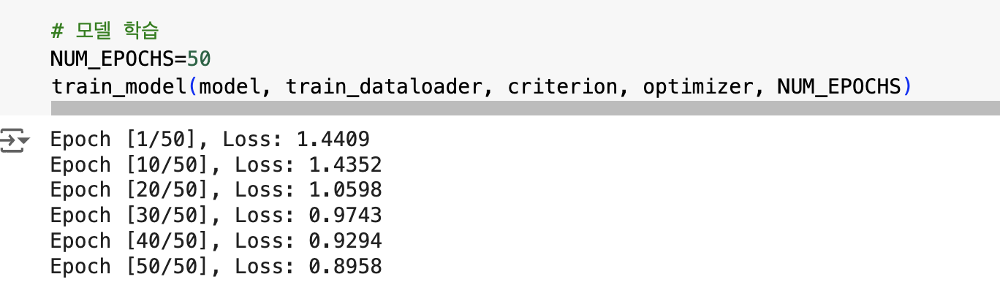
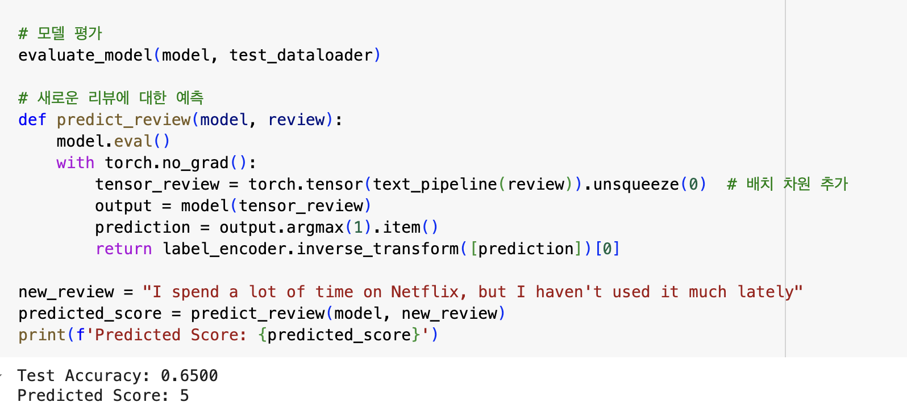
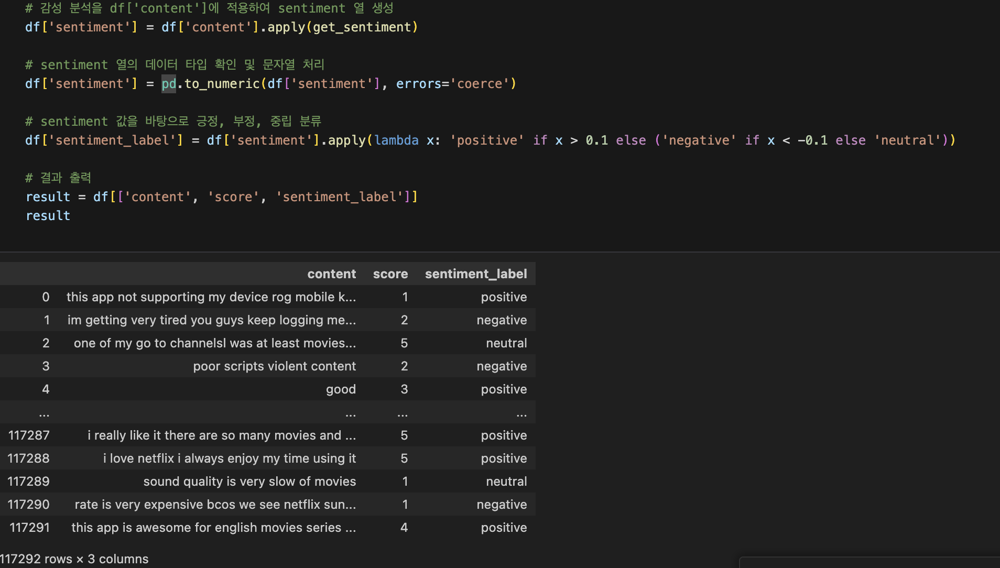
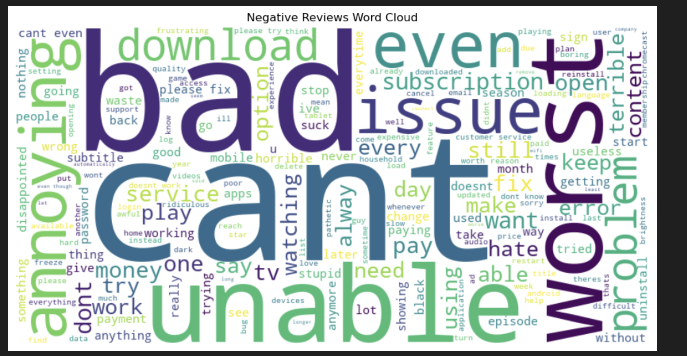

# 내일배움캠프 19일차 TIL

## 도전 과제 : 영화 리뷰 감성 분석
* 도전과제 4번 모델 학습 (LSTM)
```py

import pandas as pd
import torch
import torch.nn as nn
import torch.optim as optim
from torchtext.data.utils import get_tokenizer
from torchtext.vocab import build_vocab_from_iterator
from torch.utils.data import DataLoader, Dataset
from sklearn.model_selection import train_test_split
from sklearn.preprocessing import LabelEncoder
import torch.nn.utils.rnn as rnn_utils

# 데이터셋 클래스 정의
class ReviewDataset(Dataset): 
    def __init__(self, reviews, ratings, text_pipeline):
        self.reviews = reviews # 리뷰 텍스트의 리스트 (입력)
        self.ratings = ratings # 리뷰에 해당하는 평점 리스트 (출력)
        self.text_pipeline = text_pipeline # 텍스트 전처리 및 변환(리뷰텍스트가 모델의 입력 형식으로 변환)

    def __len__(self): # 데이터셋 크기 반환
        return len(self.reviews)

    def __getitem__(self, idx): 
        review = self.text_pipeline(self.reviews[idx]) # 리뷰가 모델이 이해할 수 있는 형식으로 변환됨
        rating = self.ratings[idx] # 지정된 인덱스에 해당하는 평점 가져옴
        return torch.tensor(review, dtype=torch.long), torch.tensor(rating, dtype=torch.long) # 텐서 형태로 리뷰와 평점 반환(dtype=torch.long 로 리뷰 변환되어 모델 입력으로 사용)

# 패딩을 위한 collate_fn 정의
# padding : 자연어 처리 등의 분야에서 불규칙한 길이의 시퀀스를 일정한 길이로 맞춤
def collate_fn(batch): # 배치에 포함될 샘플의 리스트를 받음
    # 샘플 분리
    reviews, ratings = zip(*batch) # batch : (review,rating) 형태의 튜플로 구성된 리스트. zip 으로 리뷰와 평점 분리시켜 review에 모든 리뷰, ratings 에 모든 평점이 포함되도록 함
    # 패딩 적용
    padded_reviews = rnn_utils.pad_sequence(reviews, batch_first=True) 
    # .pad_sequence : 서로 다른 길이의 시퀀스 동일한 길이로 패딩
    
    return padded_reviews, torch.stack(ratings)
# torch.stack 으로 ratings 를 하나의 텐서로 결합. 

# 텍스트 전처리 및 파이프라인 정의
tokenizer = get_tokenizer("basic_english")

def yield_tokens(data_iter):
    for text in data_iter:
        yield tokenizer(text)

# 데이터셋 준비
X = df['content'].values
y = df['score'].values

# 레이블 인코딩
label_encoder = LabelEncoder()
y_encoded = label_encoder.fit_transform(y)

# 데이터셋 분할
X_train, X_test, y_train, y_test = train_test_split(X, y_encoded, test_size=0.2, random_state=42)


# 단어 집합 생성
vocab = build_vocab_from_iterator(yield_tokens(X_train), specials=["<unk>"])
vocab.set_default_index(vocab["<unk>"])

# 텍스트 파이프라인 정의
def text_pipeline(text):
    return vocab(tokenizer(text))

# 데이터셋 정의
train_dataset = ReviewDataset(X_train, y_train, text_pipeline)
test_dataset = ReviewDataset(X_test, y_test, text_pipeline)

# 데이터 로더 정의
BATCH_SIZE = 32
train_dataloader = DataLoader(train_dataset, batch_size=BATCH_SIZE, shuffle=True, collate_fn=collate_fn)
test_dataloader = DataLoader(test_dataset, batch_size=BATCH_SIZE, shuffle=False, collate_fn=collate_fn)

# LSTM 모델 정의
class LSTMModel(nn.Module):
    def __init__(self, vocab_size, embed_dim, hidden_dim, output_dim):
        super(LSTMModel, self).__init__()
        self.embedding = nn.Embedding(vocab_size, embed_dim)
        self.lstm = nn.LSTM(embed_dim, hidden_dim, batch_first=True)
        self.fc = nn.Linear(hidden_dim, output_dim)

    def forward(self, text):
        embedded = self.embedding(text)
        output, (hidden, cell) = self.lstm(embedded)
        return self.fc(hidden[-1])

# 하이퍼파라미터 정의
VOCAB_SIZE = len(vocab) # 모델이 사용할 단어 집합의 크기
EMBED_DIM = 64 # 단어의 임베딩 차원. 각 단어는 64 차원 벡터로 표현됨
HIDDEN_DIM = 128 # 은닉층 크기 : 값이 클수록 복잡한 패턴 학습이 가능하지만 과적합 위험이 높아질 수 있음
OUTPUT_DIM = len(label_encoder.classes_)  # 모델의 출력층 : 예측할 점수 개수

# 모델 초기화
model = LSTMModel(VOCAB_SIZE, EMBED_DIM, HIDDEN_DIM, OUTPUT_DIM)

# 손실 함수와 옵티마이저 정의
criterion = nn.CrossEntropyLoss()

# SDG(확률적 경사 하강법) 옵티마이저 (주어진 학습률에 따라 각 에포크에서 파라미터 업데이트하여 손실함수 값 최소화)
# optim : PyTorch 제공 최적화 모듈로, 다양한 최적화 알고리즘 구현
# model.parameters() : 모든 파라미터(가중치와 편향)을 반환. 학습 중에 변경될 가중치와 편향 값 알려줌
optimizer = optim.SGD(model.parameters(), lr=0.01) # lr(학습률)=0.01 : 일반적으로 0.01을 자주 사용


def train_model(model, train_dataloader,criterion,optimizer,num_epochs):
    for epoch in range(num_epochs):
        model.train()
        total_loss=0
        
        for reviews, ratings in train_dataloader:
            optimizer.zero_grad()  # 이전 단계에서 계산된 기울기 초기화
            output=model(reviews)
            loss=criterion(output,ratings)
            loss.backward()
            optimizer.step()
            total_loss+=loss.item()
            
        avg_loss=total_loss /  len(train_dataloader)
        if (epoch + 1) % 10 == 0 or epoch == 0:  # 첫 번째 에포크도 출력
            print(f'Epoch [{epoch + 1}/{num_epochs}], Loss: {avg_loss:.4f}')
            
# 모델 학습
NUM_EPOCHS=50
train_model(model, train_dataloader, criterion, optimizer, NUM_EPOCHS)
```

```py
# 모델 평가 함수
def evaluate_model(model, test_dataloader):
    model.eval()
    correct=0
    total=0
    
    with torch.no_grad():
        for reviews, ratings in test_dataloader:
            output=model(reviews)
            predicted=output.argmax(1)
            total+=ratings.size(0)
            correct+=(predicted==ratings).sum().item()
            
    accuracy=correct/total
    print(f'Test Accuracy: {accuracy:.4f}')
    
# 모델 평가
evaluate_model(model, test_dataloader)

# 새로운 리뷰에 대한 예측
def predict_review(model, review):
    model.eval()
    with torch.no_grad():
        tensor_review = torch.tensor(text_pipeline(review)).unsqueeze(0)  # 배치 차원 추가
        output = model(tensor_review)
        prediction = output.argmax(1).item()
        return label_encoder.inverse_transform([prediction])[0]

new_review = "I spend a lot of time on Netflix, but I haven't used it much lately"
predicted_score = predict_review(model, new_review)
print(f'Predicted Score: {predicted_score}')

```

* 도전과제 5번 
```py
# 5 NLP 이용해 감성 분석
import nltk
from textblob import TextBlob
import pandas as pd
import gensim
from gensim import corpora
from gensim.utils import simple_preprocess

def get_sentiment(text):
    return TextBlob(text).sentiment.polarity
# 감성 분석을 df['content']에 적용하여 sentiment 열 생성
df['sentiment'] = df['content'].apply(get_sentiment)

# sentiment 열의 데이터 타입 확인 및 문자열 처리
df['sentiment'] = pd.to_numeric(df['sentiment'], errors='coerce')

# sentiment 값을 바탕으로 긍정, 부정, 중립 분류
df['sentiment_label'] = df['sentiment'].apply(lambda x: 'positive' if x > 0.1 else ('negative' if x < -0.1 else 'neutral'))

# 결과 출력
result = df[['content', 'score', 'sentiment_label']]
result

```


* 도전과제 6번

```py
import pandas as pd
import matplotlib.pyplot as plt
from wordcloud import WordCloud, STOPWORDS

# 부정적인 리뷰 필터링
negative_reviews = ' '.join(df[df['sentiment_label'] =="negative"]['content'])

# 불용어 설정
stopwords = set(STOPWORDS)
stopwords.update(['watch','account','netflix','use','im','new','will','shows','video','screen','update','now','device', 'movie', 'show', 'time', 'app', 'series', 'phone','movies'])

# WordCloud 생성
wordcloud = WordCloud(width=800, height=400, background_color='white', stopwords=stopwords).generate(negative_reviews)

# WordCloud 출력
plt.figure(figsize=(12, 6))
plt.imshow(wordcloud, interpolation='bilinear')
plt.axis('off')
plt.title('Negative Reviews Word Cloud')
plt.show()
```

---

## 알게 된 것


* VSCode 의 jupyter notebook (.ipynb 파일) 에서 input()을 입력 받으려고 하면 무한 로딩 문제가 생김
  * 해결방법 [VSCode jupyter input() 무한로딩](https://ks-jun.tistory.com/37)
* torchtext OSError
  * `conda install -y torchtext -c pytorch` 를 (가상환경에서)터미널에 입력하고 VSCode를 재시작하니 해결 (참고로 사용한 컴은 M1 MACOs임)
  * 추가로, 팀원분의 팁으로는 torchtext 는 pytorch가 2.3.0 이어야 해결된다고 하셨음
    * 나중에 코랩으로도 실행해봤을 때 `!pip install torch==2.3.0
` 로 torch 를 다운받고 `!pip install torchtext` 를 하니 정상적으로 코드가 돌아갔다.
---
## 회고
* Epoch
  * 학습 반복횟수인 epoch 수를 50으로 했더니 Accuracy 가 65 로 10이나 20,30 으로 했을 때보다 높았다.
  * 하지만 한 에포크당 2분 30초 정도씩 걸려서 50번을 반복하니 학습에만 27분이나 걸렸다.
  * 어떻게 하면 Accuracy를 더 높이고, 더 빠르게 학습 시킬 수 있는지 알아봐야겠다
* VSCode : 딥러닝 모델 학습시 CPU 99% , 발열 심했음
* 코랩 - GPU : 속도도 비슷한데 CPU 에는 지장이 없었어서 좋았음
  * 단점 : 연결이 끊기거나 다시 들어올 때마다 구글 드라이브 파일 연결부터 토치텍스트 다운까지 처음부터 다 해야함