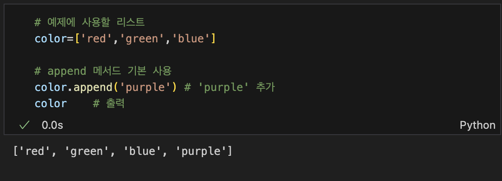
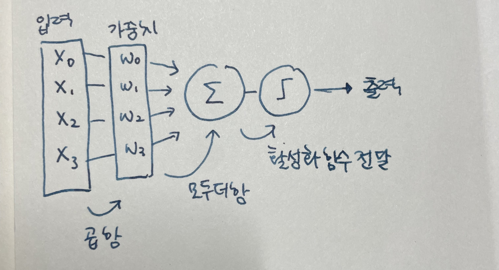
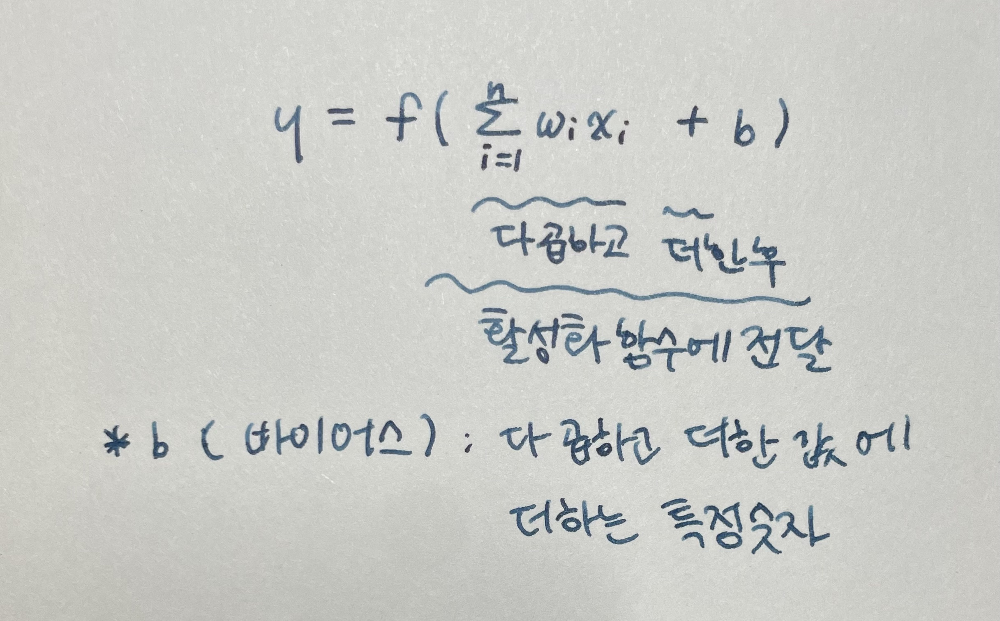
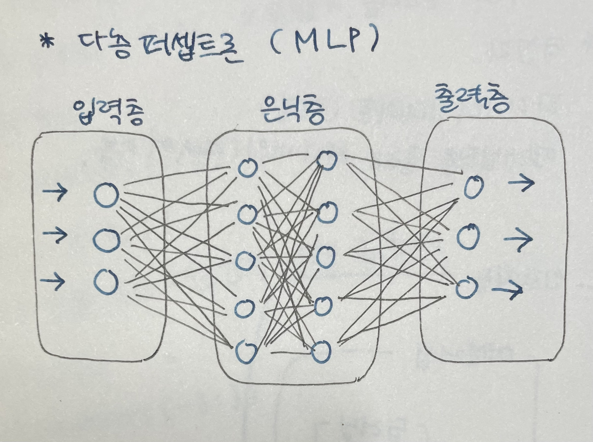

# 내일배움캠프 13일차 TIL 
---
## 파이썬 코드카타 DAY 5
1. 옷가게 할인 받기
   * 문제 설명 :10만 원 이상 사면 5%, 30만 원 이상 사면 10%, 50만 원 이상 사면 20%를 할인, 구매한 옷의 가격 `price` 가 주어지면 지불 금액을 `return` 하는 `solution` 함수 만들기
   * 제출 코드
    ```py
    def solution(price):
        if price >= 500000:
            discount = 0.2  # 50만 원 이상일 때 20% 할인
        elif price >= 300000:
            discount = 0.1  # 30만 원 이상일 때 10% 할인
        elif price >= 100000:
            discount = 0.05  # 10만 원 이상일 때5% 할인
        else:
            discount = 0  # 할인 없음

        return int(price * (1 - discount))    # 지불해야 할 돈 계산 후, 돈은 소수점이하의 개념이 없으므로 정수로 바꾸기
    ```
2. 아이스 아메리카노
   * 문제 설명
     * 가지고 있는 돈 money가 매개변수로 주어질 때, 최대로 마실 수 있는 아메리카노의 잔 수와 남는 돈을 순서대로 담은 배열을 return 하도록 solution 함수를 완성
   * 제출 코드
    ```py
    def solution(money):
        cup=money//5500 # 최대로 마실 수 있는 잔 수
        left=money%5500 # 남은 돈 나머지로 계산하기
    
        answer = [cup,left]
        return answer
    ```
3. 나이 출력
   * 문제 설명
     * 나이 age 가 주어질 때, 2022년 기준으로 출생 연도를 return 하는 함수 solution
   * 제출 코드
    ```py
    def solution(age):
        return 2022-age+1
    ```
4. 배열 뒤집기
   * 문제 설명
     * 정수가 들어 있는 배열 num_list가 매개변수로 주어집니다. num_list의 원소의 순서를 거꾸로 뒤집은 배열을 return하는 solution 함수 완성
   * 제출 코드
    ```py
    def solution(num_list):
        return num_list[::-1] # 리스트의 슬라이싱을 활용해 역순으로 값 반환
    ```
### 추가 공부
##### 리스트 슬라이싱
*  기본 문법 `list[시작:종료:간격]`
    *  시작 : 시작할 인덱스 (포함)
    *  종료 : 종료할 인덱스 (미포함)
    *  간격 : 요소 선택 간격 (기본값 1)
* 기본 슬라이싱
    *  인덱스 2부터 5까지, 6은 포함 X
    
* 간격 활용
    *  리스트 모든 요소 3칸 간격 선택
    
* 음수 인덱스
    * 리스트 끝에서부터 요소 선택
    
* 역순 슬라이싱
    * 리스트를 역순으로 반환
    

##### append() 메서드
  * append 메서드
    * 리스트에 새 요소를 추가할 때 사용
    * 리스트 마지막에 요소 추가
    * 리스트 직접 수정
  * 기본 문법 `리스트이름.append(추가할요소)`
  * 사용 예시
    
  * 다양한 데이터 타입 추가
  
  * 반복문과 사용
  
---
## 머신러닝 5주차

* 앙상블학습 : 여러 개의 학습 모델 결합 -> 하나의 강력한 모델
  * 베깅 : 여러 개의 학습 모델 병렬 학습-> 평균 또는 다수결 결합
    * 랜덤 포레스트
  * 부스팅 : 여러 개의 약한 학습기를 순차적 학습 -> 결과 결합해 강한 학습기 만들기
    * 그래디언트 부스팅 머신(GBM)
    * XGBoost

: XGBoost가 성능이 좋다고 모든 상황에서 쓰는게 좋은 것은 아니고 각 모델마다 사용하기 좋은 상황이 있음!

----
## 딥러닝 1주차
### 딥러닝의 개념
(Deep Learning)
* 인공지능 (AI) : 인간의 지능을 모방해 문제를 해결하는 기술
* 머신러닝 (ML) : 데이터를 이용해 모델 학습, 예측이나 결정을 내리는 기술
* **딥러닝 (DL)** : **다층 신경망**을 사용해 데이터 학습. **대규모 데이터와 복잡한 문제 다루기 적합**

### 딥러닝의 특징
* 비선형 추론 : 복잡한 데이터 패턴 학습 가능
* 다층 구조 : 여러 층의 신경망으로 복잡한 데이터의 특징 학습
* 자동 특징 추출
### 신경망의 기본 원리
* 인공신경망 (=뇌)
  * 퍼셉트론 (Perceptron) : 인공신경망의 가장 기본 단위 (=뉴런)
    * 입력 값을 받아 가중치를 곱하고, 이를 모두 더한 후 활성화 함수를 통해 출력값을 결정


* 다층 퍼셉트론(MLP)
  * 입력층 : 외부 데이터 입력받음
  * 은닉층 : 입력층과 출력층 사이에 위치해 입력데이터를 처리하고 특징 추출
  * 출력층 : 최종 예측값 출력

* 활성화함수 : 각 퍼셉트론에서 입력값을 출력값으로 변환. 비선형성 학습 가능
  * ReLU
  * Sigmoid : 확률 표현
  * Tanh
* 손실함수 : 모델 예측값과 실제 값의 차이 측정. 모델 성능 평가
  ->값이 낮을수록 모델 성능 good!
  * mse : 회귀 문제에서 주로 사용
  * cross-Entropy : 분류 문제에서 주로 사용
* 최적화 알고리즘
* 역전파 : 연쇄법칙을 통해 여러 개의 층을 미분
