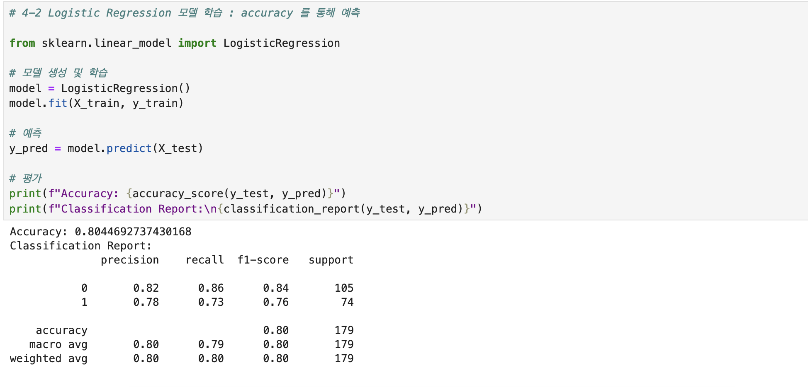
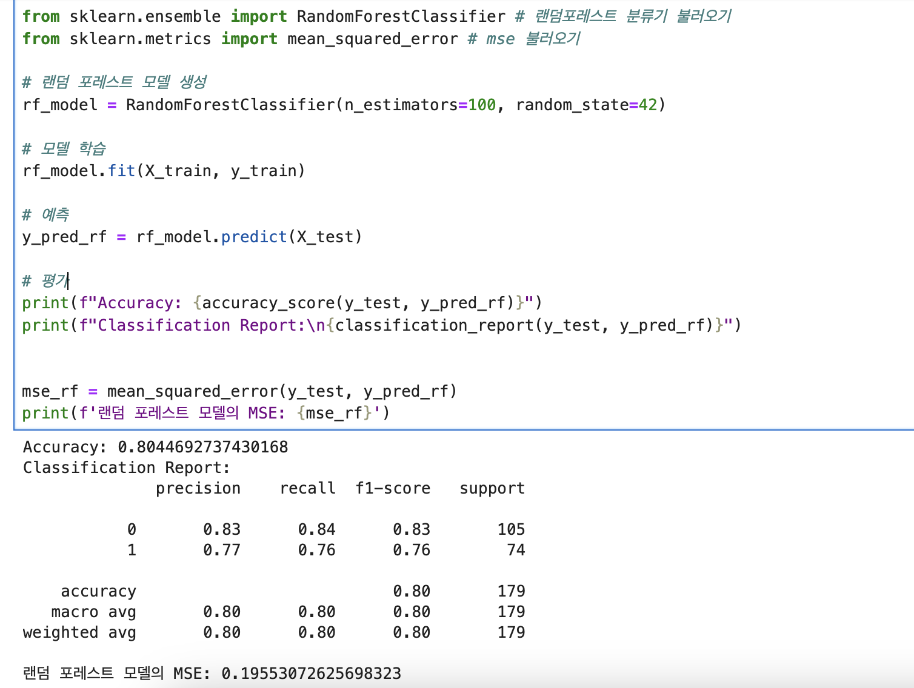

# 내일배움캠프 17일차 TIL

## 파이썬 코드카타 DAY 9
```py
# 개미군단
def solution(hp):
    answer = 0
    answer+=hp//5
    hp%=5
    answer+=hp//3
    hp%=3
    answer+=hp//1
    hp%=1
    
    return answer

# 모스부호(1)
def solution(letter):
    answer=''
    morse = { 
    '.-':'a','-...':'b','-.-.':'c','-..':'d','.':'e','..-.':'f',
    '--.':'g','....':'h','..':'i','.---':'j','-.-':'k','.-..':'l',
    '--':'m','-.':'n','---':'o','.--.':'p','--.-':'q','.-.':'r',
    '...':'s','-':'t','..-':'u','...-':'v','.--':'w','-..-':'x',
    '-.--':'y','--..':'z'
    }
    split_letter=letter.split()
    for i in split_letter:
        answer+=morse[i]
    return answer


# 가위 바위 보
def solution(rsp):
    answer=''
    for i in range(len(rsp)):
        if rsp[i]=='2':
            answer+='0'
        elif rsp[i]=='0':
            answer+='5'
        else:
            answer+='2'
    return answer


# 구슬을 나누는 경우의 수
from math import factorial
def solution(balls, share):

    balls_fac=factorial(balls)
    b_s_fac=factorial(balls-share)
    share_fac=factorial(share)

    return balls_fac/(b_s_fac*share_fac)
```
---
## 팀 필수 과제 : 타이타닉 생존자 예측
* 데이터셋 불러오고 전처리 후 분할, 스케일링
```py
# 데이터셋 불러오기
import seaborn as sns
import numpy as np
import pandas as pd

titanic=sns.load_dataset('titanic')

# 3-1 결측치 처리 : Age 결측치는 중앙값(median), Embarked 결측치는 최빈값(mode)으로 대체
titanic['age'].fillna(titanic['age'].median(), inplace=True)
# fillna(결측치를대체할값,inplace=True) 메서드 : 결측값 대체. inplace 옵션의 기본값은 False로, 이는 변경사항을 원본데이터프레임에 적용할지를 나타냄
titanic['embarked'].fillna(titanic['embarked'].mode()[0], inplace=True)

# 3-2 수치형으로 인코딩 : Sex에서 male=0, female=1, alive에서 yes=1, no=0 으로 변환
# embarked에서 C=0,Q=1,S=2로 변환 후, 그 결과를 head 로 확인
# map() 메서드 : 데이터 값 변환
titanic['sex']=titanic['sex'].map({'male':0,'female':1})
titanic['alive']=titanic['alive'].map({'yes':1,'no':0})
titanic['embarked']=titanic['embarked'].map({'C':0,'Q':1,'S':1})

# 3-3 새로운 Feature 생성 : SibSip,Parch 를 통해 family_size 생성 후 head 로 확인
titanic['family_size']=titanic['sibsp']+titanic['parch']+1
# +1을 해주는 이유 : 각 승객의 가족 크기 계산시 그 승객 본인을 포함해야 하기 때문에

# 4-1 모델 학습 준비 : 학습에 필요한 feature 들과 target 을 분리 후 스케일링
# 학습에 필요한 feature : 'survived', 'pclass', 'sex', 'age', 'sibsp', 'parch', 'fare', 'embarked', 'family_size'
titanic=titanic[['survived', 'pclass', 'sex', 'age', 'sibsp', 'parch', 'fare', 'embarked', 'family_size']]
X=titanic.drop('survived',axis=1) # fearue
# 'survived' 열을 제외한 나머지 열을 X에 저장
y=titanic['survived'] # target
# 'survived' 열만 선택하여 target 생성 (모델이 예측할 생존 여부)
# 필요한 라이브러리 불러오기

from sklearn.model_selection import train_test_split
from sklearn.preprocessing import StandardScaler

# 데이터 분할
X_train, X_test, y_train, y_test = train_test_split(X, y, test_size=0.2, random_state=42)
# test_size=0.2 : 전체 데이터의 20%를 평가용 데이터로 사용
# random_state=42 : 랜덤 시드를 사용해 동일한 데이터 분할과 초기화를 하기 위해 설정함

# 데이터 스케일링 : 각 특성의 값 범위를 비슷하게 조정해 모델 학습의 효율성을 높임
scaler = StandardScaler()
X_train = scaler.fit_transform(X_train)
# fit() : 각 특성의 평균과 표준편차 계산
X_test = scaler.transform(X_test)
# fit 사용시 테스트 데이터의 정보가 모델 학습에 영향을 줄 수 있으므로, 
```
* LogisticRegression 모델 생성 및 학습
```py
# 4-2 Logistic Regression 모델 학습 : accuracy 를 통해 예측

from sklearn.linear_model import LogisticRegression

# 모델 생성 및 학습
model = LogisticRegression()
model.fit(X_train, y_train)

# 예측
y_pred = model.predict(X_test)

# 평가
print(f"Accuracy: {accuracy_score(y_test, y_pred)}")
print(f"Classification Report:\n{classification_report(y_test, y_pred)}")
```
* LogisticRegression 학습 후 평가


* RandomForestClassifier 모델 생성 및 학습
```py
# 4-3 Random Forest  
from sklearn.metrics import accuracy_score, classification_report

from sklearn.ensemble import RandomForestClassifier # 랜덤포레스트 분류기 불러오기
from sklearn.metrics import mean_squared_error # mse 불러오기

# 랜덤 포레스트 모델 생성
rf_model = RandomForestClassifier(n_estimators=100, random_state=42)

# 모델 학습
rf_model.fit(X_train, y_train)

# 예측
y_pred_rf = rf_model.predict(X_test)

# 평가
print(f"Accuracy: {accuracy_score(y_test, y_pred_rf)}")
print(f"Classification Report:\n{classification_report(y_test, y_pred_rf)}")


mse_rf = mean_squared_error(y_test, y_pred_rf)
print(f'랜덤 포레스트 모델의 MSE: {mse_rf}')
```
* RandomForestClassifier 모델 평가

* XGBoost 모델 생성 및 학습
```py
import xgboost as xgb
from sklearn.metrics import mean_squared_error

# XGBoost 모델 생성
xgb_model = xgb.XGBRegressor(n_estimators=150, learning_rate=0.1, max_depth=3, random_state=42)

# 모델 학습
xgb_model.fit(X_train, y_train)

# 예측
y_pred_xgb = xgb_model.predict(X_test)

# 평가
mse_xgb = mean_squared_error(y_test, y_pred_xgb)
print(f'XGBoost 모델의 MSE: {mse_xgb}')
```
* XGBoost 모델 평가


---
## 추가적으로 알아본 것
* 파이썬에서 **팩토리얼** 사용하는 법
  ```py
  from math import factorial
  print(math.factorial(4)) # 출력 : 24
  ```
* RandomForest 에서 코드가 같아도 Accuracy 값이 각각 다르게 나오는 이유
  * 랜덤 포레스트는 내부적으로 여러 결정 트리를 생성하고 각 트리를 만드는 과정에서 무작위로 샘플링을 수행하므로 **`random_state`가 동일해도 내부적인 무작위성**으로 인해 **각 트리의 결과가 달라질 수 있음**

